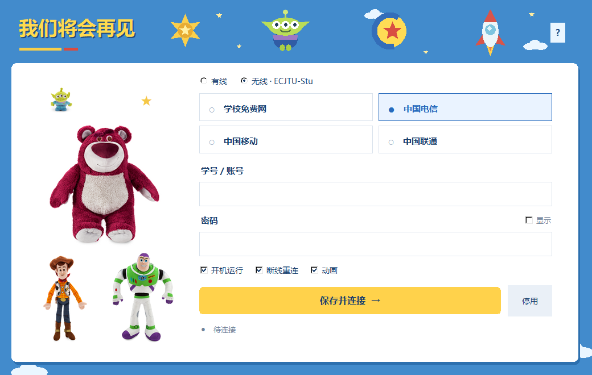

# 我们将会再见

**作者：shukunNie**

用于**华东交通大学校园网快速认证**的 Windows 工具，支持有线校园网和 **ECJTU-Stu** 无线网络。保存账号后，程序在检测到网络变化时自动尝试认证，减少反复打开认证网页、手动输入账号密码的操作。

**个人开发的辅助工具，非学校或运营商官方客户端。** 正式版 **v1.0.0**。



## 下载与使用

进入右侧 **Releases**，下载 `SeeYouAgain-1.0.0-Windows-x64.zip`，解压后双击 `我们将会再见.exe`。无需安装 Python。

1. 接上校园网网线，或在 Windows 中连接 **ECJTU-Stu** 并勾选自动连接。
2. 选择连接方式和服务，填写自己的账号密码，点击“保存并连接”。
3. 有线和无线、学校免费网和运营商分别保存账号密码。
4. 勾选“开机运行”和“断线重连”后，可关闭设置窗口，由后台继续工作。

有线按“已保存的学校免费网 → 已保存的运营商”顺序尝试，不混用各模块密码。连接方式不可用时自动尝试另一种已配置的连接；两种都可用时优先最后保存的方式。

## 功能

- 学校免费网、电信、移动、联通服务选择。
- Windows 网络事件监听和快速网卡状态核对，自动响应有线/无线切换。
- 联网验证通过后显示成功提示；尽力识别并关闭校园认证标签页。
- 当前 Windows 用户登录后自启动，断线恢复、错误退避及重试上限。
- 单文件 EXE，适用于 Windows 10 / 11 x64。

## 隐私

发布包和源码不含开发者或原使用者的账号密码、个人配置及认证日志。新电脑首次打开需要填写自己的账号。

密码通过 Windows DPAPI 加密，存放在当前用户 `%LOCALAPPDATA%\ECJTUAutoLogin`。设置不会写回 EXE；仅复制 EXE 不会携带账号。曾使用过本程序的电脑会读取该 Windows 用户原有配置。“停用”会删除所有模块的本地凭据并移除启动项。

认证请求绑定对应网卡直接连接校园认证服务器，不使用系统代理。

## 验证范围与限制

- 47 项本地检查通过；验证独立 EXE、自启动安装副本和 Windows 网络通知。
- 用户现场确认有线学校免费网认证成功；一次认证阶段记录约 0.43 秒，不是固定速度保证。
- 运营商模式未逐一现场验证；校园认证接口变化可能需要更新。
- 自动关闭认证网页受浏览器状态与辅助功能接口影响，尚未完成真实关闭效果验证。它不会结束整个浏览器进程。
- 本工具不负责开通或绑定运营商账号，也不绕过校园网的服务权限。

## 从源码运行 / 构建

在 Windows 下使用 Python 3.13：

```powershell
python -m venv .venv
.\.venv\Scripts\python.exe -m pip install -r requirements-build.txt
.\.venv\Scripts\python.exe src\portable_app.py
```

构建独立 EXE：

```powershell
.\.venv\Scripts\python.exe -m PyInstaller --noconfirm --onefile --windowed --name SeeYouAgain --icon src\connect.ico --add-data "src\connect.ico;." --add-data "src\close_portal.ps1;." --add-data "src\assets-v3;assets-v3" src\portable_app.py
```

运行检查（不会提交真实账号）：

```powershell
$env:PYTHONPATH = "$PWD\src"
.\.venv\Scripts\python.exe -m unittest discover -s tests
```

## 参考与素材

协议参考：[ECJTUCampusNetwork-AutoLogin](https://github.com/bestxiangest/ECJTUCampusNetwork-AutoLogin)。
学校网络说明：[华东交通大学网络信息中心](https://nic.ecjtu.edu.cn/info/1010/1463.htm)。

角色图片来自 Disney Store，版权归相应权利人，来源记录见 `licenses/Theme-Friends-Sources.md`。来源记录不代表获得商业使用或再授权许可。运行时第三方许可见 `licenses`。

